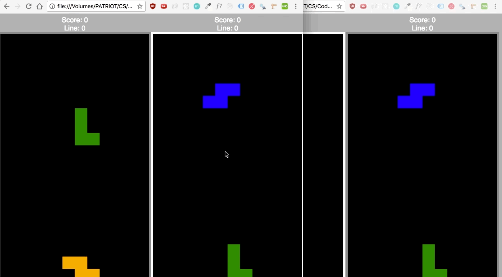

## Tetris Multiplayer

Works locally, but has not been deployed.

### However, two player Tetris can be played here:

[Tetris, 2-player](https://goo.gl/voR27T)

- LEFT PLAYER keys: A, S, D, W
- RIGHT PLAYER keys: Up, Down, Left, Right

## Using Websockets on Heroku w/ Node.js
- steps to create realtime Node.js applications on heroku. These instructions allow sharing of server's current time with client via persistent socket connection, using Node's express web server.
https://devcenter.heroku.com/articles/node-websockets

Steps to run application locally after cloning:
- npm install
- Run npm start
- Copy full path to index.html, and paste onto browser to open application

### Implementation steps
...did not record steps prior...

10. When local player is playing, the moment another player is added. Nothing is happening. The added players need to get a message from the server to "join-session". We want to know if the added players are playing. To do this, create event library to listen and emit events when player is playing, such as updating player score, updating player position changes.

To test on browser, access a instances Set object using the following command: `[...tetrisManager.instances][0].player.score = 100` will update player score to 100.

10. a) Update drop(), invocations of updateScore(), reset(), and rotate() to incorporate this.events.emit() 'pos', 'score', 'matrix'.

10. b) When board is cleared or when an object merges, we need to send updates to board. Include events to listen to in Board class. `this.events.emit('matrix', this.matrix)` in clear(), merge(), and removeLine() of Board class.

11. Connect event listeners to player when player connects/joins the server. Create a watchEvents() in connectionManager.js to send data to server when state-updates (ie. pos, matrix, or score changes). When piece merges, state updates and logs board matrix.

12. Broadcast data when state-updates. Whenever, you get state update on the server, send/broadcast data to all clients/peers in server/main.js.

13. Whenever player refreshes page, the game state does not get saved. In other words, the tiles are missing.
We need to keep a record of the game state on the server that we send during broadcast. Create and call serialize() to return an object, a simple representation of the gameThe initial state does not get saved.

14. Make sure when invoking broadcastSession(), an updated copy of the player state is saved to the server. The initial state of opposing player is saved on refresh.

15. Add sorting in connectionManager to get all the tetris instances in the correct order according to the peers Map object. Next, send updated sorted array to tetrisManager to sort it for us. appendChild to document.body for every instance of tetris created. This allows proper order of player creation in the browser.
